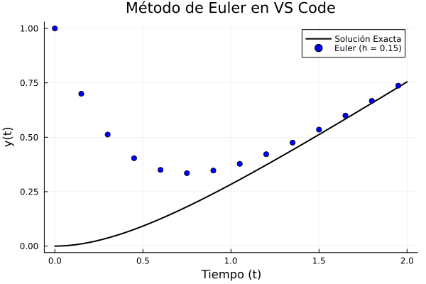

# Análisis Numérico con Julia 🚀

Repositorio oficial con los materiales, códigos interactivos y simulaciones para el curso de **Análisis Numérico**.

---

## 👨‍🏫 Información del Curso
* **Autor:** Miguel Ángel Chávez García  
* **Institución:** FES Acatlán, UNAM  

---
## Análisis numérico en Ecuaciones Diferenciales Aordinarias
## 📌 Método de Euler (Ecuaciones Diferenciales Ordinarias)

El **Método de Euler** es un procedimiento de integración numérica de primer orden para resolver ecuaciones diferenciales ordinarias (EDO) a partir de un valor inicial dado.

### 📊 Representación Gráfica
A continuación se muestra la comparación entre la **Solución Exacta** y la **Aproximación por Euler** generada en Julia:



---

## 📂 Contenido de la unidad

| Archivo | Descripción |
| :--- | :--- |
| **`EDO_Euler.jl`** | Script base en Julia con el algoritmo y generación de gráficas. |
| **`Euler.ipynb`** | Cuaderno interactivo de Jupyter listo para ejecutar en clase. |
| **`euler.mp4`** | Video demostrativo del comportamiento del método. |
| **`euler_comparativo.mp4`** | Comparación animada del efecto del tamaño de paso ($h$). |

---

## 🛠️ Requisitos e Instalación

Para ejecutar estos códigos localmente necesitas **Julia** y el paquete de visualización:

```julia
using Pkg
Pkg.add("Plots")
